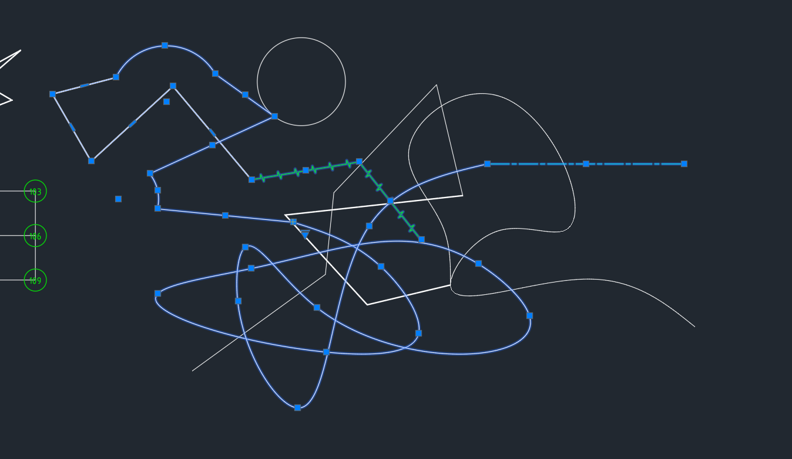

# CadTools

2026/3/16  
前年将 AutoCAD 用作工作时，我就简单研究了下 ObjectARX，本来想根据工作需要开发工具提升效率的，后面一直搁置了。最近几天又想起来，就开始动工了。
  
## 使用命令

* yx：查看基本信息
* yxSetByLayer 或 yxSBL：设置选中实体的颜色、线型、线宽为 ByLayer
* yxDimensionFix 或 yxDF：固定标注
* yxDimensionResume 或 yxDR：恢复关联标注
* yxAddSurroundingCharsForDimension 或 yxASCFD：在标注前后添加指定符号（各自指定）
* yxRemoveSurroundingCharsForDimension 或 yxRSCFD：在标注前后移除指定符号（各自指定），可以只移除前或后，不移除的不填。  
  

* yxSetBasicBox 或 yxSBB：为标注设置理论尺寸框
* yxUnsetBasicBox 或 yxUBB：为标注取消理论尺寸框
* yxSetRefDim 或 yxSRD：为标注设置参考尺寸括号
* yxUnsetRefDim 或 yxURD：为标注取消参考尺寸括号
* yxInsertSerialNumberBlockWithStartNumber 或 yxISNSBN：从指定序号开始插入序号块
  
  

## 测试环境

* Visual Studio 2022（C++20 标准编译）
* ObjectARX 2026  
* AutoCAD Mechanical 2026  
  
开发环境配置可以参考我的博客：https://blog.iyatt.com/?p=21187  

