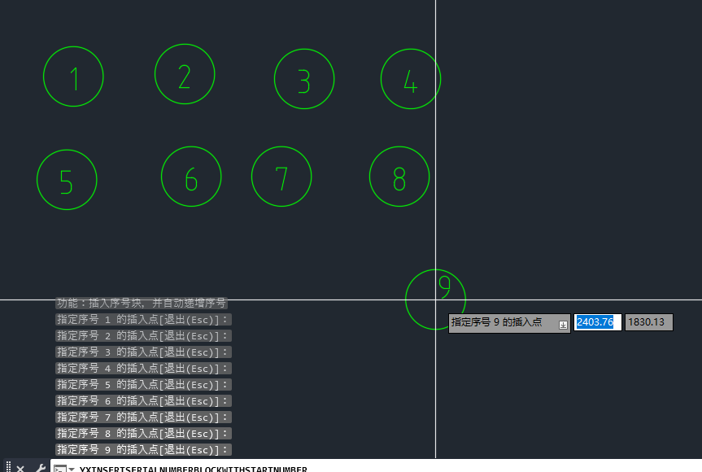
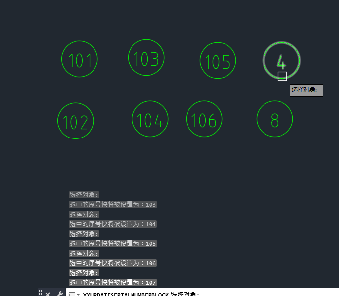
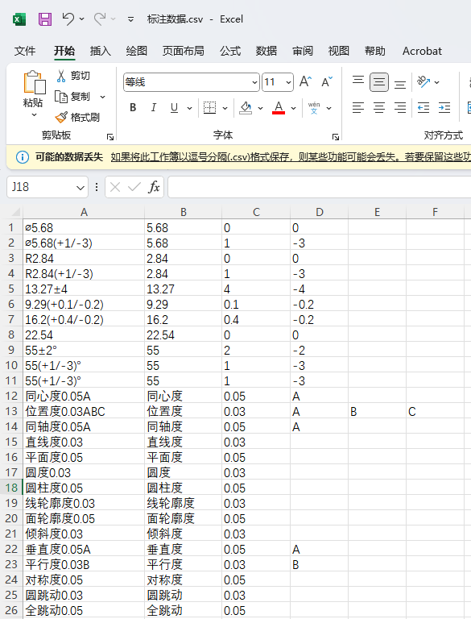

# CadTools

2026/3/16  
前年将 AutoCAD 用作工作时，我就简单研究了下 ObjectARX，本来想根据工作需要开发工具提升效率的，后面一直搁置了。最近几天又想起来，就开始动工了。  

2026/3/23  
补充说明：开发是面向 AutoCAD Mechanical （机械）版本，本插件在其它版本的 CAD 中可能无法使用。  
  
## 使用命令

* yx：查看基本信息
* yxSetByLayer 或 yxSBL：设置选中实体的颜色、线型、线宽为 ByLayer
* yxDimensionFix 或 yxDF：固定标注
* yxDimensionResume 或 yxDR：恢复关联标注
* yxAddSurroundingCharsForDimension 或 yxASCFD：在标注前后添加指定符号  
* yxRemoveSurroundingCharsForDimension 或 yxRSCFD：在标注前后移除指定符号   
  

* yxSetBasicBox 或 yxSBB：为标注设置理论尺寸框
* yxUnsetBasicBox 或 yxUBB：为标注取消理论尺寸框
* yxSetRefDim 或 yxSRD：为标注设置参考尺寸括号
* yxUnsetRefDim 或 yxURD：为标注取消参考尺寸括号
* yxInsertBalloonNumberBlockWithStartNumber 或 yxISNSBN：从指定序号开始插入气泡号块，序号自动递增。缩放比例由注释比例控制。  
  
  
* yxUpdateBalloonNumberBlock 或 yxUSNB：更新气泡号，从指定序号值开始递增。可以单点执行，点一个更新一个。可以批量选择，然后选择递增的排序方式，比如 RD 右下，即从左到右，同时从上往下逐行更新。  
  
  
* yxExtractAnnotations 或 yxEA：提取尺寸标注、形位公差、多行文本、单行文本到 csv 文件。
  
  
在 Excel 中，切换到`数据`选项卡，打开`从文本/CSV`，在里面导入 csv 文件  
  

## 测试环境

软件：  
* Visual Studio 2022
* AutoCAD Mechanical 2026  
  
SDK：  
* ObjectARX SDK 2026  
* AutoCAD Mechanical SDK 2026  

编译标准：  
* C++20  

ObjectARX 环境配置参考：https://blog.iyatt.com/?p=21187  
AutoCAD Mechanical SDK 环境配置参考：https://blog.iyatt.com/?p=23776  

## 许可证

本项目采用 [MIT 许可证](LICENSE) 进行许可。  
