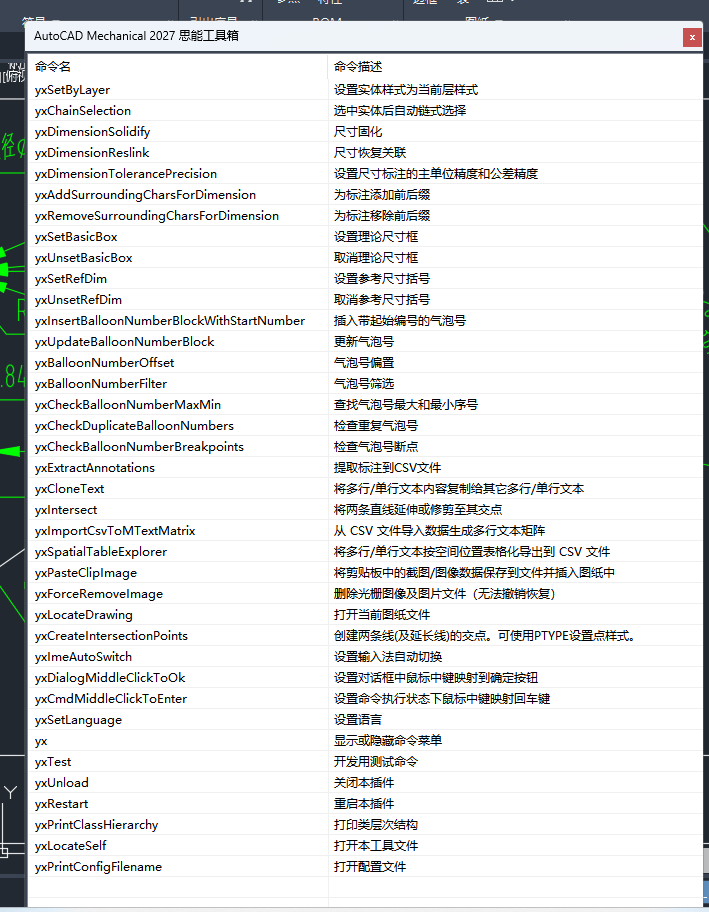
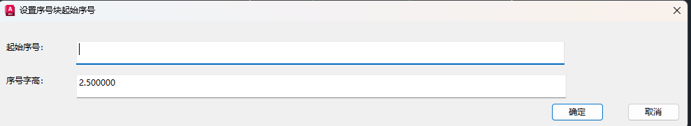
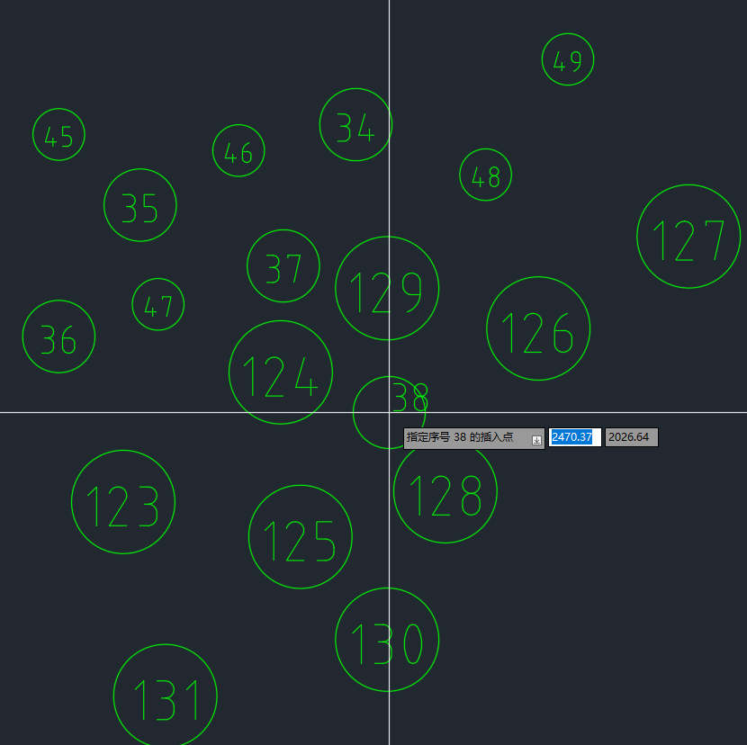

# CadTools

2026/3/16  
前年将 AutoCAD 用作工作时，我就简单研究了下 ObjectARX，本来想根据工作需要开发工具提升效率的，后面一直搁置了。最近几天又想起来，就开始动工了。  这个插件是为 AutoCAD Mechanical 版本开发的，其它版本的 AutoCAD 可能无法使用。  

## 使用方法

AutoCAD 处于打开图纸状态下，执行`APPLOAD`命令。  
切换到插件文件所在路径下，双击插件文件加载。  
可能提示“安全性 - 未签名的可执行文件”，点击`始终加载`，则下次启动不再提示。  
  
  
设置随 AutoCAD 自启动：  
点击页面上公文包图标下的`内容`按钮，点击`添加`将插件文件选入，即设为自启动。  

## 功能说明

### “批量”和“立即”

本工具中涉及选择实体操作的命令，均提供了“批量”和“立即”两种选择模式：  
* “批量”允许一次性选多个实体，并一起进行处理。可以先选中一批实体再执行命令，选择“批量”则会使用已选中的实体进行操作。也允许先执行命令，选择“批量”再去选要处理的实体。  
* “立即”则是选中一个实体处理一个实体，点击即执行。  
  

“批量”模式后还有一个“排序模式”，对于有空间顺序要求的操作会启用。比如提取数据到 CSV 是有顺序需求的，按正常阅读的顺序：从左到右，从上往下。这种顺序的操作称为“右下”，可以理解为“逐行处理，每行先向右，一行处理完，再向下换行”。  
英语中“左”为“left”，“右”为“right”，“上”为“up”，“下”为“down”，分别取首字母用作方向标识。  
共有 8 种顺序和一种无顺序：  

### yxSetByLayer

将实体的颜色、线型、线宽设置为 ByLayer。  
  
下面的几条直线处于非 ByLayer 状态。  
  

执行命令操作后，颜色、线型、线宽都改为了 ByLayer。  

## 开发

### 测试环境

软件：  
* Visual Studio Community 2026
* AutoCAD Mechanical 2026  
  
SDK：  
* ObjectARX SDK 2026  
* AutoCAD Mechanical SDK 2026  

编译标准：  
* C++23  

ObjectARX 环境配置参考：https://blog.iyatt.com/?p=21187  
AutoCAD Mechanical SDK 环境配置参考：https://blog.iyatt.com/?p=23776  
Visual Studio 2026 配置 Wizards 2026 参考：https://blog.iyatt.com/?p=24263  

### 项目开发策略

【0】紧跟最新版本的原则。  
本插件的定位是个人效率提升工具，当新版本 AutoCAD Mechanical 及 SDK 发布后，我将切换最新版进行测试。由于个人精力有限，不再针对旧版本进行维护。  
【1】本项目深度使用 AI 开发。  
我主要使用 Google Gemini 辅助，前期框架构建时，我个人参与度较高。框架搭建好后，新增功能基本由 AI 编写代码，我提供实现思路和做技术方案决策，生成代码后由我进行功能测试。AI 生成代码存在错误的，我提供 API 文档和给予纠正引导。    
【2】优先使用基于 `wchar_t` 的宽字符及宽字符串。字符串类优先使用 `AcString`，在与 MFC 交互时使用 `CString`。`AcString` 转字符串常量使用 `constPtr()` 方法。字面值常量统一使用 `L` 前缀，如 `L"这是一个字面值"`。  
【3】涉及提示的字符串全部存储到 String Table 中，命名规则：  
* 标签：IDS_LBL_标签名称
* 命令描述：IDS_CMD_命名全名
* 格式化字符串： _FMT 结尾
* 错误消息：IDS_ERR_错误名称
* 使用提示：IDS_TIP_提示名称
* 警告消息：IDS_WARN_警告名称
* 输出消息：IDS_MSG_消息名称
* 属性值：IDS_VAL_属性名称
* 操作提示：IDS_PROMPT_操作名称
* 标题：IDS_TITLE_标题名称
* 文件过滤器：IDS_FILTER_文件类型名
* 文件名：IDS_FILE_文件名  

【4】代码风格：  
* 由向导程序生成的文件中原本的代码风格不进行修改，仅自行编写的内容控制风格。
* 折行括号。大括号必须独立成行。
* 禁止单行控制流。if、else、、while、for 后的执行部分必须独立成行，必须加大括号。

【5】模块化和扩展名：由向导生成的代码和 MFC 类实现不改模块（对模块的兼容性很差），其它增加的实现采用模块。模块声明使用 `.ixx` 后缀，内联模块使用 `-inline.ixx` 后缀，传统头文件使用 `.hpp` 后缀，创建项目时生成的 `.h` 文件不修改扩展名，源文件统一使用 `.cpp` 后缀。  

### 许可证

本项目采用 [MIT 许可证](LICENSE) 进行许可。  
